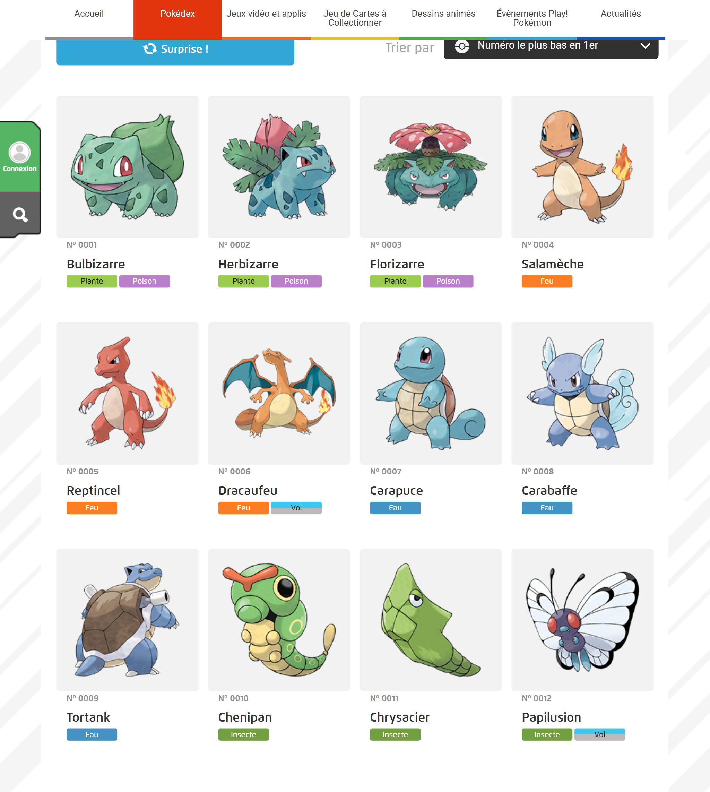
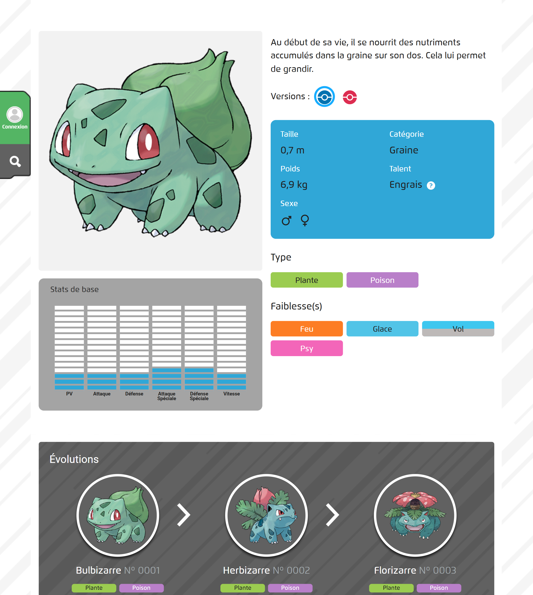

Lien vers le site en production : [brunopokedex.vercel.app](brunopokedex.vercel.app)
# Projet Pokédex : PHP & MySQL

Bienvenue sur le dépôt de mon application **Pokédex**, une plateforme web dynamique conçue pour explorer l'univers des Pokémon. Ce projet démontre la mise en place d'une architecture client-serveur complète, de la modélisation de données à l'interface utilisateur.

## 🚀 Présentation du Projet

Ce projet consiste en une application web performante permettant de consulter une base de données exhaustive de Pokémon. L'objectif principal est de proposer une expérience fluide et structurée, inspirée des standards du [Pokédex officiel](https://www.pokemon.com/fr/pokedex).

---

## 📸 Aperçu de l'interface

### Page d'accueil

Une page qui permet une visualisation rapide et efficace de la collection.

### Page de détail

Une page pour mettre en avant les caractéristiques spécifiques de chaque Pokémon.

---

## 🛠️ Conception & Architecture

Le cœur de l'application repose sur une base de données **MySQL**.

### Modèle de Données (MCD)

* Table `pokemon` : Centralise les attributs intrinsèques de chaque créature.
* Table `type` : Répertorie l'ensemble des catégories disponibles.
* Table `stats` : Répertorie l'ensemble des statistiques des Pokemons.

---
